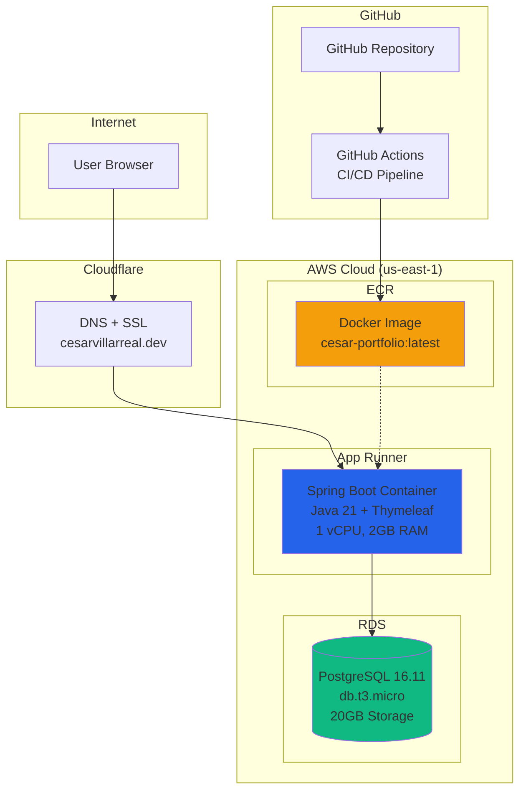

# AWS Infrastructure Setup

> Documentation of AWS setup for cesar-portfolio deployment

**Account:** 771784399457
**Region:** us-east-1
**Domain:** cesarvillarreal.dev
**Date:** 2026-02-01
**Live URL:** https://pnzm3urbwb.us-east-1.awsapprunner.com

---

## Architecture Overview

### High-Level Architecture Diagram

```
┌─────────────────────────────────────────────────────────────────────────────┐
│                              INTERNET                                        │
└─────────────────────────────────────────────────────────────────────────────┘
                                    │
                                    ▼
┌─────────────────────────────────────────────────────────────────────────────┐
│                         CLOUDFLARE (DNS + SSL)                               │
│                                                                              │
│   cesarvillarreal.dev ──CNAME──► pnzm3urbwb.us-east-1.awsapprunner.com     │
│                                                                              │
│   Features: Free SSL, DDoS Protection, CDN Caching                          │
└─────────────────────────────────────────────────────────────────────────────┘
                                    │
                                    ▼
┌─────────────────────────────────────────────────────────────────────────────┐
│                              AWS CLOUD                                       │
│  ┌───────────────────────────────────────────────────────────────────────┐  │
│  │                        AWS App Runner                                  │  │
│  │                                                                        │  │
│  │   ┌──────────────────────────────────────────────────────────────┐   │  │
│  │   │  cesar-portfolio Container                                    │   │  │
│  │   │                                                               │   │  │
│  │   │  ┌─────────────┐  ┌─────────────┐  ┌─────────────────────┐  │   │  │
│  │   │  │ Spring Boot │  │  Thymeleaf  │  │    REST API         │  │   │  │
│  │   │  │   3.2.1     │  │  Templates  │  │   /api/projects     │  │   │  │
│  │   │  │   Java 21   │  │             │  │   /actuator/health  │  │   │  │
│  │   │  └─────────────┘  └─────────────┘  └─────────────────────┘  │   │  │
│  │   │                                                               │   │  │
│  │   │  Environment: SPRING_PROFILES_ACTIVE=prod                    │   │  │
│  │   │  Port: 8080 | CPU: 1 vCPU | Memory: 2 GB                    │   │  │
│  │   └──────────────────────────────────────────────────────────────┘   │  │
│  │                                                                        │  │
│  │   Auto-scaling: 1-25 instances | Auto-deploy on ECR push             │  │
│  └───────────────────────────────────────────────────────────────────────┘  │
│                                    │                                         │
│                                    │ JDBC (Port 5432)                       │
│                                    ▼                                         │
│  ┌───────────────────────────────────────────────────────────────────────┐  │
│  │                          AWS RDS                                       │  │
│  │                                                                        │  │
│  │   ┌──────────────────────────────────────────────────────────────┐   │  │
│  │   │  PostgreSQL 16.11                                             │   │  │
│  │   │                                                               │   │  │
│  │   │  Instance: db.t3.micro (Free Tier Eligible)                  │   │  │
│  │   │  Storage: 20 GB gp2 SSD                                      │   │  │
│  │   │  Database: portfolio                                          │   │  │
│  │   │  Backups: 7-day retention                                    │   │  │
│  │   │                                                               │   │  │
│  │   │  Tables:                                                      │   │  │
│  │   │  ├── projects (id, title, slug, description, tech_stack)     │   │  │
│  │   │  ├── project_tech_stack (project_id, technology)             │   │  │
│  │   │  └── contact_messages (id, name, email, message)             │   │  │
│  │   └──────────────────────────────────────────────────────────────┘   │  │
│  │                                                                        │  │
│  │   Endpoint: cesar-portfolio-db.cy0ciel023wm.us-east-1.rds.amazonaws.com│
│  └───────────────────────────────────────────────────────────────────────┘  │
│                                                                              │
│  ┌───────────────────────────────────────────────────────────────────────┐  │
│  │                          AWS ECR                                       │  │
│  │                                                                        │  │
│  │   Repository: 771784399457.dkr.ecr.us-east-1.amazonaws.com/           │  │
│  │               cesar-portfolio:latest                                   │  │
│  │                                                                        │  │
│  │   Image: ~200MB (Alpine Linux + JRE 21)                               │  │
│  │   Scanning: Enabled on push                                            │  │
│  └───────────────────────────────────────────────────────────────────────┘  │
└─────────────────────────────────────────────────────────────────────────────┘
```

### CI/CD Pipeline Flow

```
┌──────────────┐    ┌──────────────┐    ┌──────────────┐    ┌──────────────┐
│   Developer  │    │    GitHub    │    │   GitHub     │    │     AWS      │
│   Workstation│    │  Repository  │    │   Actions    │    │    Cloud     │
└──────┬───────┘    └──────┬───────┘    └──────┬───────┘    └──────┬───────┘
       │                   │                   │                   │
       │  git push         │                   │                   │
       │──────────────────►│                   │                   │
       │                   │                   │                   │
       │                   │  Trigger CI/CD    │                   │
       │                   │──────────────────►│                   │
       │                   │                   │                   │
       │                   │                   │  1. Checkout      │
       │                   │                   │  2. Build JAR     │
       │                   │                   │  3. Build Docker  │
       │                   │                   │     (linux/amd64) │
       │                   │                   │                   │
       │                   │                   │  Push to ECR      │
       │                   │                   │──────────────────►│
       │                   │                   │                   │
       │                   │                   │                   │ ECR receives
       │                   │                   │                   │ new image
       │                   │                   │                   │
       │                   │                   │                   │ App Runner
       │                   │                   │                   │ auto-deploys
       │                   │                   │                   │
       │                   │                   │  Health check     │
       │                   │                   │◄──────────────────│
       │                   │                   │                   │
       │  Deployment       │                   │                   │
       │  notification     │                   │                   │
       │◄──────────────────┼───────────────────│                   │
       │                   │                   │                   │
```

### Mermaid Diagram (for tools that support it)



---

## Infrastructure Summary

| Resource | Identifier | ARN/URI | Status |
|----------|------------|---------|--------|
| ECR Repository | cesar-portfolio | `771784399457.dkr.ecr.us-east-1.amazonaws.com/cesar-portfolio` | ✅ Active |
| RDS PostgreSQL | cesar-portfolio-db | `cesar-portfolio-db.cy0ciel023wm.us-east-1.rds.amazonaws.com` | ✅ Running |
| App Runner | cesar-portfolio | `arn:aws:apprunner:us-east-1:771784399457:service/cesar-portfolio/15061563b85c41139499ed9184f2c67f` | ✅ Running |
| Security Group | portfolio-rds-sg | `sg-042123129440e064a` | ✅ Configured |
| IAM Role | AppRunnerECRAccessRole | `arn:aws:iam::771784399457:role/AppRunnerECRAccessRole` | ✅ Active |
| DB Subnet Group | portfolio-subnet-group | Default VPC subnets | ✅ Active |

---

## Technology Stack

### Application Layer
| Component | Technology | Version | Purpose |
|-----------|------------|---------|---------|
| Runtime | Java | 21 (LTS) | Latest long-term support JDK |
| Framework | Spring Boot | 3.2.1 | Enterprise Java framework |
| Templates | Thymeleaf | 3.1 | Server-side HTML rendering |
| Styling | Tailwind CSS | CDN | Utility-first CSS framework |
| Database ORM | Hibernate | 6.4 | JPA implementation |
| Migrations | Flyway | 10.4 | Database version control |
| Build Tool | Maven | 3.9 | Dependency management |

### Infrastructure Layer
| Component | Service | Specification | Purpose |
|-----------|---------|---------------|---------|
| Container Registry | AWS ECR | Private registry | Store Docker images |
| Compute | AWS App Runner | 1 vCPU, 2GB RAM | Run containers |
| Database | AWS RDS | PostgreSQL 16.11, db.t3.micro | Managed database |
| DNS | Cloudflare | Free tier | DNS + SSL + CDN |
| CI/CD | GitHub Actions | Ubuntu runner | Automated deployments |

### Container Specifications
| Property | Value |
|----------|-------|
| Base Image | eclipse-temurin:21-jre-alpine |
| Architecture | linux/amd64 |
| Image Size | ~200MB |
| Exposed Port | 8080 |
| Health Check | TCP on port 8080 |
| User | Non-root (appuser:1001) |

---

## Deployment Timeline

| Time | Action | Result |
|------|--------|--------|
| 17:05 | Created ECR repository | `cesar-portfolio` ready |
| 17:06 | Created RDS security group | `sg-042123129440e064a` |
| 17:06 | Created DB subnet group | `portfolio-subnet-group` |
| 17:07 | Started RDS creation | PostgreSQL 16.11 provisioning |
| 17:08 | Pushed Docker image (ARM64) | First push to ECR |
| 17:08 | Created IAM role | `AppRunnerECRAccessRole` |
| 17:12 | RDS available | Endpoint ready |
| 17:15 | Created App Runner (attempt 1) | Failed - architecture mismatch |
| 17:22 | Created App Runner (attempt 2) | Failed - same issue |
| 17:26 | Diagnosed via CloudWatch logs | Found `exec format error` |
| 17:29 | Rebuilt image for linux/amd64 | Correct architecture |
| 17:30 | Created App Runner (attempt 3) | Started successfully |
| 17:34 | App Runner running | **LIVE at https://pnzm3urbwb.us-east-1.awsapprunner.com** |

---

## 1. ECR Repository

Container registry for Docker images.

```bash
aws ecr create-repository \
  --repository-name cesar-portfolio \
  --region us-east-1 \
  --image-scanning-configuration scanOnPush=true
```

**Repository URI:** `771784399457.dkr.ecr.us-east-1.amazonaws.com/cesar-portfolio`

### Building and Pushing Images

**CRITICAL:** Build for linux/amd64 architecture (App Runner runs on x86_64):

```bash
# Login to ECR
aws ecr get-login-password --region us-east-1 | docker login --username AWS --password-stdin 771784399457.dkr.ecr.us-east-1.amazonaws.com

# Build for correct architecture and push
docker buildx build --platform linux/amd64 -t 771784399457.dkr.ecr.us-east-1.amazonaws.com/cesar-portfolio:latest --push .
```

> **Lesson Learned:** Apple Silicon Macs build ARM64 images by default. App Runner only supports x86_64, causing `exec format error`. Always use `--platform linux/amd64`.

---

## 2. RDS PostgreSQL

Managed PostgreSQL database.

### Configuration

| Setting | Value |
|---------|-------|
| Engine | PostgreSQL 16.11 |
| Instance Class | db.t3.micro (2 vCPU, 1GB RAM) |
| Storage | 20 GB gp2 SSD |
| Database Name | portfolio |
| Master Username | portfolio_admin |
| Multi-AZ | No (single AZ for cost savings) |
| Public Access | Yes (for App Runner connectivity) |
| Backup Retention | 7 days |
| Encryption | AES-256 (default) |

**Endpoint:** `cesar-portfolio-db.cy0ciel023wm.us-east-1.rds.amazonaws.com:5432`

### Security Group Configuration

```bash
# Create security group
aws ec2 create-security-group \
  --group-name portfolio-rds-sg \
  --description "Security group for Portfolio RDS" \
  --vpc-id vpc-084e05ac8fb31f357

# Allow PostgreSQL access from anywhere (App Runner needs public access)
aws ec2 authorize-security-group-ingress \
  --group-id sg-042123129440e064a \
  --protocol tcp \
  --port 5432 \
  --cidr 0.0.0.0/0
```

### DB Subnet Group

```bash
aws rds create-db-subnet-group \
  --db-subnet-group-name portfolio-subnet-group \
  --db-subnet-group-description "Subnet group for Portfolio RDS" \
  --subnet-ids subnet-0d99f96c368d03d1c subnet-09d9df5f1a3139a25 subnet-083dfebf419a7aaec
```

### Create RDS Instance

```bash
aws rds create-db-instance \
  --db-instance-identifier cesar-portfolio-db \
  --db-instance-class db.t3.micro \
  --engine postgres \
  --engine-version 16.11 \
  --master-username portfolio_admin \
  --master-user-password <PASSWORD> \
  --allocated-storage 20 \
  --storage-type gp2 \
  --db-name portfolio \
  --vpc-security-group-ids sg-042123129440e064a \
  --db-subnet-group-name portfolio-subnet-group \
  --publicly-accessible \
  --backup-retention-period 7 \
  --no-multi-az \
  --region us-east-1
```

### Database Schema (Managed by Flyway)

```sql
-- V1__initial_schema.sql
CREATE TABLE projects (
    id BIGSERIAL PRIMARY KEY,
    title VARCHAR(255) NOT NULL,
    slug VARCHAR(255) NOT NULL UNIQUE,
    short_description TEXT,
    full_description TEXT,
    github_url VARCHAR(500),
    live_url VARCHAR(500),
    image_url VARCHAR(500),
    featured BOOLEAN DEFAULT FALSE,
    display_order INTEGER DEFAULT 0,
    created_at TIMESTAMP DEFAULT CURRENT_TIMESTAMP,
    updated_at TIMESTAMP DEFAULT CURRENT_TIMESTAMP
);

CREATE TABLE project_tech_stack (
    project_id BIGINT REFERENCES projects(id) ON DELETE CASCADE,
    technology VARCHAR(100)
);

CREATE TABLE contact_messages (
    id BIGSERIAL PRIMARY KEY,
    name VARCHAR(255) NOT NULL,
    email VARCHAR(255) NOT NULL,
    message TEXT NOT NULL,
    read BOOLEAN DEFAULT FALSE,
    created_at TIMESTAMP DEFAULT CURRENT_TIMESTAMP
);
```

---

## 3. App Runner Service

Managed container hosting with auto-scaling.

### Configuration

| Setting | Value |
|---------|-------|
| CPU | 1 vCPU |
| Memory | 2 GB |
| Port | 8080 |
| Min Instances | 1 |
| Max Instances | 25 |
| Auto-deploy | Enabled (triggers on ECR push) |
| Health Check Protocol | TCP |
| Health Check Interval | 20 seconds |
| Unhealthy Threshold | 10 failed checks |

**Service URL:** `https://pnzm3urbwb.us-east-1.awsapprunner.com`
**Service ARN:** `arn:aws:apprunner:us-east-1:771784399457:service/cesar-portfolio/15061563b85c41139499ed9184f2c67f`

### Environment Variables

| Variable | Value | Purpose |
|----------|-------|---------|
| SPRING_PROFILES_ACTIVE | prod | Activates production configuration |
| DATABASE_URL | jdbc:postgresql://cesar-portfolio-db....:5432/portfolio | JDBC connection string |
| DATABASE_USERNAME | portfolio_admin | Database user |
| DATABASE_PASSWORD | <REDACTED> | Database password |

### IAM Role for ECR Access

```bash
# Create trust policy
cat > trust-policy.json << 'EOF'
{
  "Version": "2012-10-17",
  "Statement": [
    {
      "Effect": "Allow",
      "Principal": {
        "Service": "build.apprunner.amazonaws.com"
      },
      "Action": "sts:AssumeRole"
    }
  ]
}
EOF

# Create role
aws iam create-role \
  --role-name AppRunnerECRAccessRole \
  --assume-role-policy-document file://trust-policy.json

# Attach ECR access policy
aws iam attach-role-policy \
  --role-name AppRunnerECRAccessRole \
  --policy-arn arn:aws:iam::aws:policy/service-role/AWSAppRunnerServicePolicyForECRAccess
```

### Create App Runner Service

```bash
cat > apprunner-config.json << 'EOF'
{
  "ServiceName": "cesar-portfolio",
  "SourceConfiguration": {
    "AuthenticationConfiguration": {
      "AccessRoleArn": "arn:aws:iam::771784399457:role/AppRunnerECRAccessRole"
    },
    "AutoDeploymentsEnabled": true,
    "ImageRepository": {
      "ImageIdentifier": "771784399457.dkr.ecr.us-east-1.amazonaws.com/cesar-portfolio:latest",
      "ImageRepositoryType": "ECR",
      "ImageConfiguration": {
        "Port": "8080",
        "RuntimeEnvironmentVariables": {
          "SPRING_PROFILES_ACTIVE": "prod",
          "DATABASE_URL": "jdbc:postgresql://cesar-portfolio-db.cy0ciel023wm.us-east-1.rds.amazonaws.com:5432/portfolio",
          "DATABASE_USERNAME": "portfolio_admin",
          "DATABASE_PASSWORD": "<PASSWORD>"
        }
      }
    }
  },
  "InstanceConfiguration": {
    "Cpu": "1024",
    "Memory": "2048"
  },
  "HealthCheckConfiguration": {
    "Protocol": "TCP",
    "Interval": 20,
    "Timeout": 10,
    "HealthyThreshold": 1,
    "UnhealthyThreshold": 10
  }
}
EOF

aws apprunner create-service --cli-input-json file://apprunner-config.json --region us-east-1
```

---

## 4. GitHub Actions CI/CD

### Workflow File (.github/workflows/deploy.yml)

```yaml
name: Deploy

on:
  push:
    branches: [master]
  workflow_dispatch:

env:
  AWS_REGION: us-east-1
  ECR_REPOSITORY: cesar-portfolio

jobs:
  deploy:
    runs-on: ubuntu-latest
    steps:
      - uses: actions/checkout@v4

      - uses: actions/setup-java@v4
        with:
          java-version: '21'
          distribution: 'temurin'
          cache: maven

      - name: Build JAR
        run: mvn package -DskipTests

      - uses: aws-actions/configure-aws-credentials@v4
        with:
          aws-access-key-id: ${{ secrets.AWS_ACCESS_KEY_ID }}
          aws-secret-access-key: ${{ secrets.AWS_SECRET_ACCESS_KEY }}
          aws-region: ${{ env.AWS_REGION }}

      - name: Login to ECR
        uses: aws-actions/amazon-ecr-login@v2

      - name: Build and push Docker image
        run: |
          docker build --platform linux/amd64 -t $ECR_REGISTRY/$ECR_REPOSITORY:${{ github.sha }} .
          docker tag $ECR_REGISTRY/$ECR_REPOSITORY:${{ github.sha }} $ECR_REGISTRY/$ECR_REPOSITORY:latest
          docker push $ECR_REGISTRY/$ECR_REPOSITORY:${{ github.sha }}
          docker push $ECR_REGISTRY/$ECR_REPOSITORY:latest
```

### Required GitHub Secrets

| Secret | Value | Status |
|--------|-------|--------|
| AWS_ACCESS_KEY_ID | IAM access key | ⬜ To configure |
| AWS_SECRET_ACCESS_KEY | IAM secret key | ⬜ To configure |
| APP_RUNNER_SERVICE_ARN | `arn:aws:apprunner:us-east-1:771784399457:service/cesar-portfolio/15061563b85c41139499ed9184f2c67f` | ⬜ To configure |
| APP_DOMAIN | cesarvillarreal.dev | ⬜ To configure |

---

## 5. Cloudflare DNS Configuration

### DNS Records to Add

| Type | Name | Target | Proxy Status |
|------|------|--------|--------------|
| CNAME | @ | pnzm3urbwb.us-east-1.awsapprunner.com | Proxied (orange cloud) |
| CNAME | www | pnzm3urbwb.us-east-1.awsapprunner.com | Proxied (orange cloud) |

### Cloudflare Benefits
- **Free SSL:** Automatic HTTPS encryption
- **DDoS Protection:** Built-in attack mitigation
- **CDN Caching:** Faster static asset delivery
- **Analytics:** Traffic insights

---

## Troubleshooting

### Architecture Mismatch Error

**Symptom:** `exec format error` in App Runner logs

**Cause:** Docker image built for ARM64 (Apple Silicon) instead of x86_64

**Solution:**
```bash
docker buildx build --platform linux/amd64 -t <ECR_URI>:latest --push .
```

### Viewing App Runner Logs

```bash
# Find log groups
aws logs describe-log-groups --log-group-name-prefix "/aws/apprunner"

# Get recent logs
aws logs get-log-events \
  --log-group-name "/aws/apprunner/cesar-portfolio/15061563b85c41139499ed9184f2c67f/application" \
  --log-stream-name "<STREAM_NAME>" \
  --query 'events[*].message' \
  --output text
```

### Testing RDS Connectivity

```bash
PGPASSWORD=<PASSWORD> psql \
  -h cesar-portfolio-db.cy0ciel023wm.us-east-1.rds.amazonaws.com \
  -U portfolio_admin \
  -d portfolio \
  -c "SELECT COUNT(*) FROM projects;"
```

### Checking App Runner Status

```bash
aws apprunner describe-service \
  --service-arn "arn:aws:apprunner:us-east-1:771784399457:service/cesar-portfolio/15061563b85c41139499ed9184f2c67f" \
  --query 'Service.[Status,ServiceUrl]' \
  --output table
```

---

## Cost Estimates (Monthly)

| Service | Specification | Estimated Cost |
|---------|---------------|----------------|
| RDS db.t3.micro | 1 vCPU, 1GB RAM, 20GB | $15-20 (or free tier) |
| App Runner | 1 vCPU, 2GB RAM | $25-40 |
| ECR Storage | ~200MB image | < $1 |
| Data Transfer | Varies | $5-10 |
| Cloudflare | Free tier | $0 |

**Estimated Total:** $45-70/month (less with AWS free tier)

---

## LinkedIn Post Content

### Short Version
```
🚀 Just deployed my portfolio website on AWS!

Tech Stack:
• Spring Boot 3.2 + Java 21
• PostgreSQL 16 on RDS
• Docker containers on App Runner
• CI/CD with GitHub Actions
• Cloudflare for DNS + SSL

Key learnings:
• Always build Docker images with --platform linux/amd64 for AWS
• App Runner auto-deploys when you push to ECR
• Flyway handles database migrations automatically

Live at: cesarvillarreal.dev

#AWS #SpringBoot #DevOps #CloudEngineering
```

### Detailed Version
```
🏗️ Built and deployed a full-stack portfolio from scratch!

Architecture highlights:

📦 CONTAINERS
• Multi-stage Dockerfile (~200MB image)
• Eclipse Temurin JRE 21 Alpine
• Non-root user for security
• AWS ECR for private registry

⚡ COMPUTE
• AWS App Runner (serverless containers)
• Auto-scaling 1-25 instances
• Auto-deploy on image push
• TCP health checks

🗄️ DATABASE
• RDS PostgreSQL 16.11
• Flyway for version-controlled migrations
• Automated backups (7-day retention)

🔄 CI/CD
• GitHub Actions pipeline
• Build → Test → Docker → ECR → Deploy
• Zero-downtime deployments

🌐 NETWORKING
• Cloudflare DNS + free SSL
• DDoS protection included

Lesson learned: Apple Silicon builds ARM64 images by default.
AWS App Runner needs x86_64. Use: docker buildx build --platform linux/amd64

Total cost: ~$50/month

Check it out: cesarvillarreal.dev
Source: github.com/Cesar6060/cesar-portfolio

#AWS #SpringBoot #Docker #PostgreSQL #DevOps #CloudArchitecture
```

---

## Cleanup Commands

```bash
# Delete App Runner service
aws apprunner delete-service \
  --service-arn "arn:aws:apprunner:us-east-1:771784399457:service/cesar-portfolio/15061563b85c41139499ed9184f2c67f"

# Delete RDS instance (skip final snapshot for dev)
aws rds delete-db-instance \
  --db-instance-identifier cesar-portfolio-db \
  --skip-final-snapshot

# Delete ECR repository and all images
aws ecr delete-repository \
  --repository-name cesar-portfolio \
  --force

# Delete security group (after RDS is deleted)
aws ec2 delete-security-group \
  --group-id sg-042123129440e064a

# Delete DB subnet group
aws rds delete-db-subnet-group \
  --db-subnet-group-name portfolio-subnet-group

# Delete IAM role
aws iam detach-role-policy \
  --role-name AppRunnerECRAccessRole \
  --policy-arn arn:aws:iam::aws:policy/service-role/AWSAppRunnerServicePolicyForECRAccess

aws iam delete-role \
  --role-name AppRunnerECRAccessRole
```
