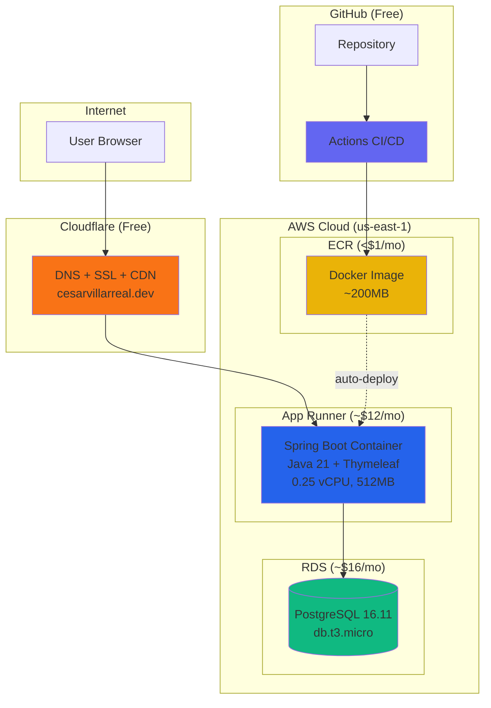
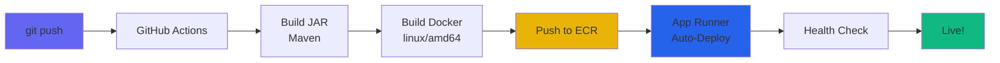
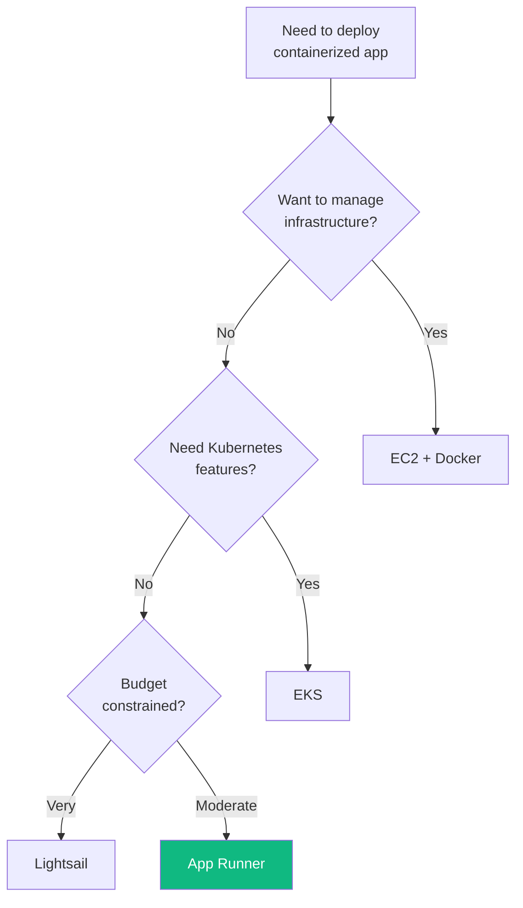

# Portfolio Deployment - LinkedIn Post Content

> Content for sharing the portfolio deployment journey on LinkedIn

**Live Site:** https://cesarvillarreal.dev
**Source Code:** https://github.com/Cesar6060/cesar-portfolio

---

## Architecture Diagram

```
                                    ┌─────────────────┐
                                    │     Users       │
                                    │   (Browser)     │
                                    └────────┬────────┘
                                             │
                                             ▼
                              ┌──────────────────────────────┐
                              │      CLOUDFLARE              │
                              │   cesarvillarreal.dev        │
                              │                              │
                              │  • Free SSL/TLS              │
                              │  • DDoS Protection           │
                              │  • Global CDN                │
                              └──────────────┬───────────────┘
                                             │
                                             ▼
┌────────────────────────────────────────────────────────────────────────────┐
│                            AWS CLOUD (us-east-1)                            │
│                                                                             │
│  ┌─────────────────────────────────────────────────────────────────────┐   │
│  │                         AWS App Runner                               │   │
│  │                                                                      │   │
│  │   ┌───────────────────────────────────────────────────────────┐    │   │
│  │   │              Docker Container                              │    │   │
│  │   │                                                            │    │   │
│  │   │   Spring Boot 3.2 + Java 21 + Thymeleaf                   │    │   │
│  │   │                                                            │    │   │
│  │   │   0.25 vCPU | 512 MB RAM | Auto-scaling 1-25              │    │   │
│  │   └───────────────────────────────────────────────────────────┘    │   │
│  │                                                                      │   │
│  │   Auto-deploy on ECR push | TCP Health Checks                       │   │
│  └──────────────────────────────────┬──────────────────────────────────┘   │
│                                     │                                       │
│                                     │ JDBC                                  │
│                                     ▼                                       │
│  ┌──────────────────────────────────────────────────────────────────────┐  │
│  │                           AWS RDS                                     │  │
│  │                                                                       │  │
│  │   PostgreSQL 16.11 | db.t3.micro | 20 GB                             │  │
│  │   Automated Backups | 7-day retention                                 │  │
│  └──────────────────────────────────────────────────────────────────────┘  │
│                                                                             │
│  ┌──────────────────────────────────────────────────────────────────────┐  │
│  │                           AWS ECR                                     │  │
│  │                                                                       │  │
│  │   Private Container Registry | ~200MB Image | Scan on Push           │  │
│  └──────────────────────────────────────────────────────────────────────┘  │
│                                                                             │
└────────────────────────────────────────────────────────────────────────────┘
                                     ▲
                                     │
                              Push to ECR
                                     │
┌────────────────────────────────────┴───────────────────────────────────────┐
│                           GITHUB ACTIONS                                    │
│                                                                             │
│   git push → Build JAR → Build Docker (linux/amd64) → Push to ECR          │
│                                                                             │
│   Triggers: Push to master | Auto-deploy via App Runner                    │
└────────────────────────────────────────────────────────────────────────────┘
```

---

## Services Used & Why

### 1. AWS App Runner (Compute)

**What it is:** Fully managed container service that automatically builds, deploys, and scales containerized applications.

**Why I chose it:**
- No infrastructure to manage (no EC2, no ECS clusters, no Kubernetes)
- Auto-scaling built-in (scales to zero traffic, scales up on demand)
- Auto-deploy when new images are pushed to ECR
- Built-in HTTPS and load balancing
- Simple pricing model

**Tradeoffs:**
| Pros | Cons |
|------|------|
| Zero ops overhead | Less control than ECS/EKS |
| Auto-scaling included | Limited to containers only |
| Quick deployments (~2 min) | Can't scale to 0 instances (min is 1) |
| Built-in health checks | Higher cost than EC2 for always-on workloads |

**Alternatives considered:**
- **ECS Fargate:** More control, but more complex setup
- **EC2:** Cheapest, but requires server management
- **Lambda:** Would require rewriting as functions
- **Lightsail:** Cheaper but less auto-scaling

---

### 2. AWS RDS PostgreSQL (Database)

**What it is:** Managed relational database service.

**Why I chose it:**
- Automated backups and point-in-time recovery
- Managed patches and updates
- Multi-AZ option for high availability (not used, for cost)
- Familiar PostgreSQL - same as local development

**Tradeoffs:**
| Pros | Cons |
|------|------|
| Fully managed | More expensive than self-hosted |
| Automated backups | No free tier after 12 months |
| Easy scaling | Minimum instance size still costs ~$15/mo |
| High availability option | Public access needed for App Runner |

**Alternatives considered:**
- **Aurora Serverless:** Auto-scaling but more expensive
- **Self-hosted on EC2:** Cheaper but more work
- **Neon/Supabase:** Free tier available, but external dependency

---

### 3. AWS ECR (Container Registry)

**What it is:** Private Docker container registry.

**Why I chose it:**
- Integrates natively with App Runner (auto-deploy on push)
- Private and secure
- Image scanning for vulnerabilities
- Same AWS account = no auth complexity

**Tradeoffs:**
| Pros | Cons |
|------|------|
| Native AWS integration | Not free (though very cheap) |
| Image vulnerability scanning | Locked into AWS ecosystem |
| Private by default | - |

**Alternatives considered:**
- **Docker Hub:** Free tier, but public images or paid for private
- **GitHub Container Registry:** Free, but extra auth setup for AWS

---

### 4. Cloudflare (DNS + CDN)

**What it is:** DNS provider with free SSL, CDN, and DDoS protection.

**Why I chose it:**
- Completely free tier
- Automatic SSL certificates
- DDoS protection included
- Global CDN for static assets
- Easy DNS management

**Tradeoffs:**
| Pros | Cons |
|------|------|
| Free | Adds complexity vs using Route 53 |
| Free SSL | Proxy can complicate debugging |
| DDoS protection | - |
| Fast DNS propagation | - |

**Alternatives considered:**
- **Route 53:** Native AWS, but costs $0.50/zone/month + queries
- **Namecheap DNS:** Free but no CDN/SSL

---

### 5. GitHub Actions (CI/CD)

**What it is:** Automated workflow platform built into GitHub.

**Why I chose it:**
- Free for public repos
- Native GitHub integration
- Marketplace actions for AWS, Docker, Java
- YAML-based, version controlled

**Tradeoffs:**
| Pros | Cons |
|------|------|
| Free | Limited minutes on private repos |
| Native to GitHub | Locked to GitHub |
| Easy secrets management | - |
| Parallel jobs | - |

**Alternatives considered:**
- **AWS CodePipeline:** Native AWS but more complex
- **Jenkins:** Self-hosted, more control but more ops work
- **CircleCI:** Good but GitHub Actions is simpler

---

## Cost Breakdown

| Service | Specification | Monthly Cost |
|---------|---------------|--------------|
| App Runner | 0.25 vCPU, 512MB RAM | ~$10-15 |
| RDS | db.t3.micro, 20GB | ~$15-18 |
| ECR | ~200MB storage | < $1 |
| Data Transfer | ~1GB | ~$1-2 |
| Cloudflare | Free tier | $0 |
| GitHub Actions | Free tier | $0 |
| **Total** | | **~$28-35/month** |

### Cost Optimization Applied

Original configuration: 1 vCPU, 2GB RAM (~$40/month for App Runner)
Optimized configuration: 0.25 vCPU, 512MB RAM (~$12/month for App Runner)

**Savings: ~$25-30/month** by right-sizing for actual workload

---

## Key Learnings

### 1. Docker Architecture Matters

**Problem:** Built Docker image on Apple Silicon Mac (ARM64). App Runner runs on x86_64.

**Error:** `exec format error` in CloudWatch logs

**Solution:** Always build with `--platform linux/amd64`:
```bash
docker buildx build --platform linux/amd64 -t <image> --push .
```

### 2. App Runner Custom Domains Require Validation

**Problem:** Added CNAME in Cloudflare but got 404 errors.

**Reason:** App Runner doesn't recognize requests unless the domain is registered with the service.

**Solution:**
1. `aws apprunner associate-custom-domain`
2. Add certificate validation CNAME records
3. Wait for validation (~2-5 minutes)

### 3. Cost Optimization is Critical

Started with "default" configurations that were overkill for a portfolio site:
- 1 vCPU, 2GB RAM for a simple Spring Boot app
- Could run on 0.25 vCPU, 512MB easily

**Lesson:** Start small, scale up if needed. Monitor actual usage before over-provisioning.

---

## LinkedIn Posts

### Short Version (For Feed)

```
Just deployed my portfolio on AWS!

Tech Stack:
- Spring Boot 3.2 + Java 21
- PostgreSQL 16 on RDS
- Docker on App Runner
- CI/CD with GitHub Actions
- Cloudflare for DNS + SSL

Key insight: Apple Silicon builds ARM64 images by default. AWS needs x86_64.
Cost me 2 hours debugging "exec format error" until I found the fix:
docker buildx build --platform linux/amd64

Total cost: ~$30/month (after optimization)

Live: cesarvillarreal.dev

#AWS #SpringBoot #DevOps #CloudEngineering #Java
```

### Detailed Version (For Article)

```
Building and Deploying a Full-Stack Portfolio on AWS

I just finished deploying my portfolio website using a modern cloud-native architecture. Here's what I learned:

THE ARCHITECTURE

User -> Cloudflare (DNS/SSL) -> App Runner (Container) -> RDS (PostgreSQL)

GitHub Actions handles CI/CD: push to master triggers build, Docker image creation, and automatic deployment.

WHY THESE SERVICES?

App Runner: Zero infrastructure management. Push an image, it deploys. Auto-scales. Built-in HTTPS.

RDS PostgreSQL: Managed database with automated backups. Same PostgreSQL I use locally.

Cloudflare: Free SSL, DDoS protection, and global CDN. Can't beat free.

THE BIGGEST GOTCHA

I develop on an Apple Silicon Mac. Docker builds ARM64 images by default. App Runner runs on x86_64.

Result: "exec format error" - the container couldn't even start.

Fix: docker buildx build --platform linux/amd64

This took 2 hours to debug. CloudWatch logs were the key - without them I'd still be guessing.

COST OPTIMIZATION

Initial estimate: $50-70/month
After right-sizing: $28-35/month

The default App Runner config (1 vCPU, 2GB) was overkill. A portfolio site runs fine on 0.25 vCPU and 512MB.

THE STACK

- Java 21 + Spring Boot 3.2
- Thymeleaf for server-side rendering
- Tailwind CSS for styling
- Flyway for database migrations
- Docker with multi-stage builds

WHAT I'D DO DIFFERENTLY

1. Use Neon or Supabase for the database (free tier)
2. Set up budget alerts BEFORE deploying
3. Start with smallest instance sizes

Check it out: cesarvillarreal.dev
Source: github.com/Cesar6060/cesar-portfolio

#AWS #SpringBoot #Docker #PostgreSQL #DevOps #CloudArchitecture #Java #CloudEngineering
```

---

## Mermaid Diagrams (For Tools That Support It)

### Architecture Diagram



### CI/CD Pipeline



### Decision Flow: Why App Runner?



---

## Interview Talking Points

### "Walk me through a technical decision you made"
- **Why Spring Boot for a portfolio?** Could have used a static site generator, but chose Spring Boot to practice the stack used in target roles (enterprise Java), demonstrate pragmatic technology choices, and enable dynamic features.
- **Why Server-Side Rendering over React?** Portfolio sites are content-focused, not interaction-heavy. Better SEO out of the box. Single deployable artifact simplifies operations. Shows I choose appropriate tools.

### "How do you approach infrastructure?"
- Used AWS CLI for all infrastructure setup (documented in AWS_SETUP.md)
- ECR for container registry, App Runner for compute, RDS for database
- Infrastructure is reproducible - all commands documented
- Cost-optimized from day one (right-sized instances)

### "Tell me about your CI/CD experience"
- GitHub Actions pipeline: push to master → build JAR → build Docker → push to ECR → auto-deploy
- App Runner automatically deploys when new images are pushed
- Zero-downtime deployments built-in

### "How do you document your work?"
- Architecture Decision Records (ADRs) in ARCHITECTURE_DECISIONS.md
- Step-by-step setup guide in AWS_SETUP.md
- All CLI commands captured for reproducibility

### "What would you do differently at scale?"
- Move to ECS/EKS for more control over container orchestration
- Add CloudFront CDN for global distribution
- Database read replicas for high availability
- Consider Aurora Serverless for auto-scaling database

### "How do you handle cost optimization?"
- Started with default configs, then right-sized based on actual needs
- Reduced App Runner from 1 vCPU/2GB to 0.25 vCPU/512MB (saved ~$25/month)
- Set up budget alerts before costs accumulate
- Evaluated free alternatives (Neon for database) for future optimization

---

## Quick Reference

**Live Site:** https://cesarvillarreal.dev
**GitHub:** https://github.com/Cesar6060/cesar-portfolio
**App Runner ARN:** `arn:aws:apprunner:us-east-1:771784399457:service/cesar-portfolio/...`
**RDS Endpoint:** `cesar-portfolio-db.cy0ciel023wm.us-east-1.rds.amazonaws.com`
**Monthly Cost:** ~$30
